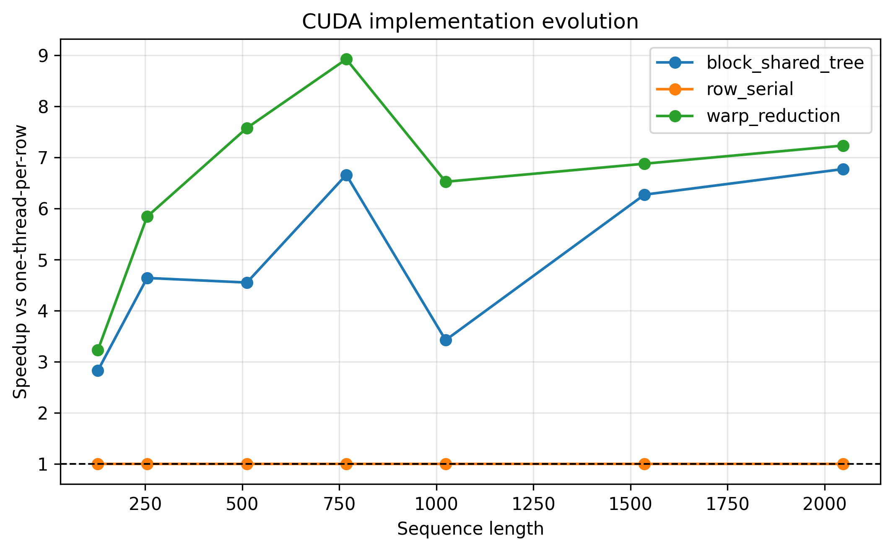
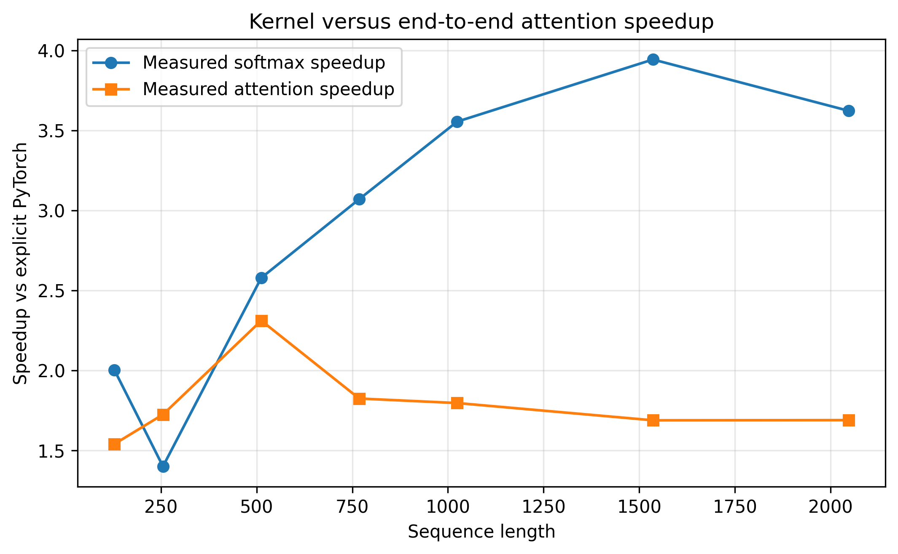

# Research journey: teaching a softmax row to cooperate

## The question

Transformer attention is usually introduced as one equation. I focused on one
part of it—the causal scaled softmax—and asked how thread ownership, parallel
reductions, warp communication, and launch size change GPU performance. Then I
put the custom operator back between the two attention matrix multiplications
to see how much kernel speedup survived at application level.

This is a learning-oriented systems project, not a replacement for PyTorch
SDPA. One source file evolves through Git; tests come before timing; raw samples
remain attached to their measured commit; and negative comparisons stay public.

## The seven-part journey

### 1. Define correct behavior without CUDA

The project began on Apple Silicon with a transparent PyTorch reference. Stable
softmax subtracts the maximum before exponentiation. Causal indexing uses
`query_position = row % sequence_length`, so every future column is excluded
from both reductions and written as exact zero. Odd widths and magnitude stress
cases established the contract before GPU code existed.

### 2. Build the smallest honest CUDA baseline

The first CUDA mapping gave one complete row to one global thread. It was easy
to inspect: that thread found the maximum, accumulated exponentials, and
normalized. It was also deliberately serial inside every row. The point was to
create a correct performance baseline, not to disguise a first attempt as an
optimization.

### 3. Expose parallel work inside a row

One block then owned each row. Threads processed strided columns, accumulated
register-local partials, and combined them through shared-memory reduction
trees. Barriers were data dependencies: threads could not read partials until
all writers had published them, and scratch memory could not be reused until
the block-wide result was safe.

### 4. Replace block-wide trees with two-level warp reductions

Warp shuffles combined register values among 32 lanes. Each warp wrote one
partial result to a compact shared array, and the first warp finished the
block-wide maximum or sum. The algorithm still needed one inter-warp barrier;
shuffle operations did not erase synchronization between independent warps.

### 5. Tune and integrate without changing the question

The same kernel accepted 128, 256, or 512 threads. Equivalent isolated
softmax paths compared custom CUDA with eager and steady-state
`torch.compile`. Complete attention kept `QK^T` and `probabilities @ V`
explicit around the custom operator, while PyTorch SDPA served as a production
baseline with a broader possible fusion boundary.

### 6. Run the controlled NVIDIA experiment

The complete notebook ran on one Tesla T4 at measured commit `ca87722a`, using
FP32, seed 1234, 25 warmups, and 100 CUDA-event samples for each implementation
and length. The supplied run contains every raw CSV, environment record,
generated figure, table, profiler export, and the executed notebook.

### 7. Audit before publishing

The final work reconstructs all medians and quartiles from raw samples, verifies
shape/implementation matrices and commit provenance, hashes each figure and its
direct sources, preserves CPU-only and NVIDIA handoffs, and tests that the Git
history still contains only one primary CUDA source.

## Measured results

All 88 structured softmax cases passed at fixed FP32 tolerances. Maximum
absolute error was `3.5763e-7`; future probabilities were exactly zero; and no
unexpected NaNs or infinities appeared.

Across sequence lengths 128--2048, the final warp kernel was 3.22--8.92x faster
than the row-serial checkpoint and 1.07--1.91x faster than the block/shared-tree
checkpoint. This separates the large effect of exposing intra-row parallelism
from the smaller additional effect of changing how partial results communicate.

Launch behavior varied: 128 threads won five shapes, 256 won the two longest,
and 512 won none. The experiment's aggregate rule selected 128. That is a T4
observation, not a universal launch constant.

The custom softmax was 1.40--3.94x faster than equivalent eager PyTorch and beat
steady-state `torch.compile` at six of seven shapes. At length 2048,
`torch.compile` was about 2.1% faster.

Custom explicit attention improved on explicit eager attention by 1.54--2.31x.
Softmax-only speedup was larger in six of seven cases because both matrix
multiplications remained. Production SDPA was faster than the explicit custom
path at every measured length, by 1.25--2.53x.

## What failed and why it matters

The first Colab extension build failed because a CUDA infinity constant depended
on a transitive header. Adding the explicit header fixed portability before any
performance claim was made. Earlier Nsight orchestration also failed to place
the package on the target's import path; the corrected full handoff later
captured four kernel launches. These failures remain part of the engineering
record because reproducibility includes toolchain and orchestration details.

## What the evidence supports

The data supports that, for this T4 workload, block-per-row work decomposition
was the largest optimization step, warp communication further reduced latency,
and launch preference depended on shape. It also supports a partial rather than
complete translation of softmax speedup into explicit attention.

The data does not support a universal best block size, a cross-architecture
speedup, a backward/training claim, or one proven memory/compute bottleneck.
Nsight's roughly 48% peak DRAM and 57% peak SM throughput are measurements, but
not enough to assign one exclusive cause.

## Evidence and code

- [Paper and evidence map](mini_paper.md)
- [Kernel history](kernel_evolution.md)
- [Raw experiment directory](../results/runs/2026-08-23_tesla-t4_ca87722/)
- [Figure provenance](result_provenance.md)
- [Reproduce on Apple Silicon](cpu_reproducibility.md)
- [Reproduce on NVIDIA](nvidia_handoff.md)
- [All 112 research steps](../WEBSITE_JOURNAL.md)

## Student reflection

`TODO(student): Add your own short account of what surprised you, what changed
your mental model, and which result you would investigate next. The repository
does not infer personal reflection from test or benchmark output.`
